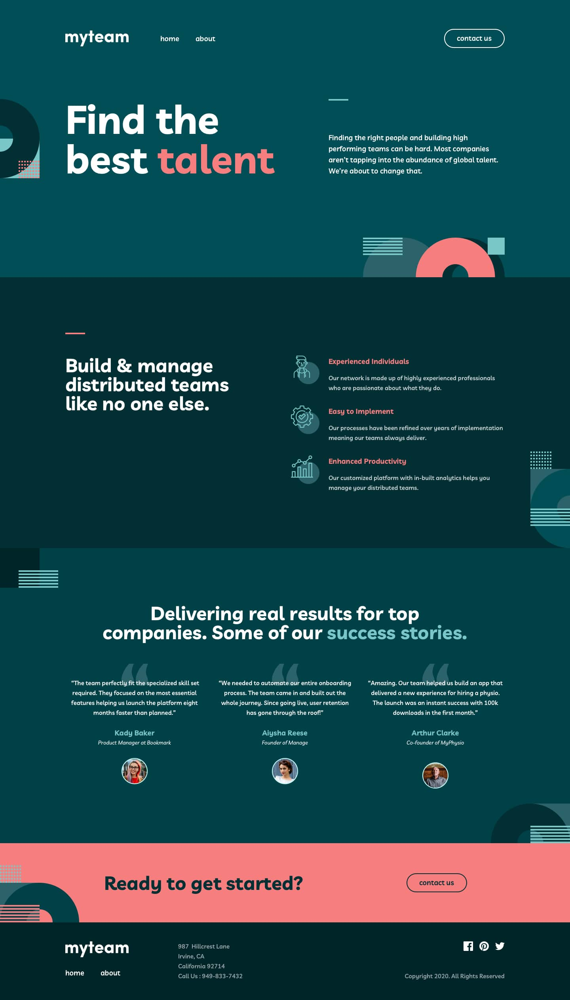

### To the site:https://ralexr.github.io/MyTeam--MultiPage-Project/

#### MyTeam is a exercise project - 3 Page Layout

Aim of this project is to coppy 1/1 the design, and build with HTML/CSS/JS.

So I will resume here what I learned form this one :

This one was a real challenge because I implemented all things I learnd from tutorials and courses, at the begining was hard but in the end I nail it!

I learned how important is a solid HTML structure and how to build a responsive layout, combine Grid and Flex.

I still have some issues with implementing some elements.

**Summary**

- DRY, better HTML/Layout structure !, responsive behavior.

**First project without any help**

Credits [Frontend Mentor](https://www.frontendmentor.io/challenges/myteam-multipage-website-mxlEauvW).

